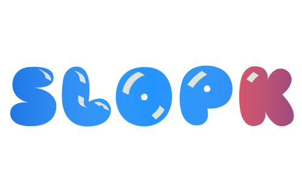

<!-- Credits to https://github.com/othneildrew/Best-README-Template/ -->
<a id="readme-top"></a>

[![Contributors][contributors-shield]][contributors-url]
[![Forks][forks-shield]][forks-url]
[![Stargazers][stars-shield]][stars-url]
[![Issues][issues-shield]][issues-url]
[![GPL 3.0 License][license-shield]][license-url]

<!-- PROJECT LOGO -->
<br />
<div align="center">
  <a href="https://github.com/officialasyrafrahim/slopk">
    
  </a>

  <h3 align="center">Slopk</h3>

  <p align="center">
    An analysis tool designed to combat against stolen content, made for TikTok TechJam 2025.
    <br />
    <a href="https://github.com/officialasyrafrahim/slopk"><strong>Explore the docs »</strong></a>
    <br />
    <br />
    <a href="https://www.youtube.com/watch?v=-Beil3adCHs">View Demo</a>
    &middot;
    <!--
    <a href="">Report Bug</a>
    /&middot;
    <a href="">Request Feature</a>
    -->
  </p>
</div>


<!-- TABLE OF CONTENTS -->
<details>
  <summary>Table of Contents</summary>
  <ol>
    <li>
      <a href="#about-the-project">About The Project</a>
      <ul>
        <li><a href="#built-with">Built With</a></li>
      </ul>
    </li>
    <li>
      <a href="#getting-started">Getting Started</a>
      <ul>
        <li><a href="#prerequisites">Prerequisites</a></li>
        <li><a href="#installation">Installation</a></li>
      </ul>
    </li>
    <li><a href="#usage">Usage</a></li>
    <li><a href="#roadmap">Roadmap</a></li>
    <li><a href="#contributing">Contributing</a></li>
    <li><a href="#license">License</a></li>
    <li><a href="#contact">Contact</a></li>
    <li><a href="#acknowledgments">Acknowledgments</a></li>
  </ol>
</details>


<!-- ABOUT THE PROJECT -->
## About The Project

[![Video link][product-screenshot]](https://www.youtube.com/watch?v=-Beil3adCHs)

Slopk is a one-stop solution that aims to improve the quality and legitimacy of content by providing an advanced content management toolkit for social media platforms, content creators and consumers. These tools include:
1. detection/blocking tool that uses computer vision and AI language models to fight against "slop" content such as vulgar, inappopriate, and low quality AI-generated videos and art.
2. media analysis tool for platform administrators and users to analyse content statistics and performance.

<p align="right">(<a href="#readme-top">back to top</a>)</p>


### Built With

This section should list any major frameworks/libraries used to bootstrap your project. Leave any add-ons/plugins for the acknowledgements section. Here are a few examples.

* [![React][React.js]][React-url]
* [![Lynx][Lynx.js]][Lynx-url]
* [![Tailwind][Tailwind.com]][Tailwind-url]
* [![Streamlit][Streamlit.io]][Streamlit-url]

<p align="right">(<a href="#readme-top">back to top</a>)</p>


<!-- GETTING STARTED -->
## Getting Started

This is an example of how you may give instructions on setting up your project locally.
To get a local copy up and running follow these simple example steps.

### Prerequisites

These are the list of software to install:
* npm
  ```sh
  npm install npm@latest -g
  ```
* react
* lynx
* streamlit
* npm packages in requirements.txt
* tailwind

### Installation

_Below is an example of how you can instruct your audience on installing and setting up your app. This template doesn't rely on any external dependencies or services._

1. Get a free API Key at [https://assemblyai.com](https://www.assemblyai.com/)
2. Clone the repo
   ```sh
   git clone https://github.com/github_username/repo_name.git
   ```

<p align="right">(<a href="#readme-top">back to top</a>)</p>


<!-- USAGE EXAMPLES -->
## Usage

Use this space to show useful examples of how a project can be used. Additional screenshots, code examples and demos work well in this space. You may also link to more resources.

_For more examples, please refer to the [Documentation](https://example.com)_

<p align="right">(<a href="#readme-top">back to top</a>)</p>


<!-- ROADMAP -->
## Roadmap

- [x] Add Changelog
- [x] Add back to top links
- [ ] Add Additional Templates w/ Examples
- [ ] Add "components" document to easily copy & paste sections of the readme
- [ ] Multi-language Support
    - [ ] Chinese
    - [ ] Spanish

See the [open issues](https://github.com/officialasyrafrahim/slopk/issues) for a full list of proposed features (and known issues).

<p align="right">(<a href="#readme-top">back to top</a>)</p>


<!-- CONTRIBUTING -->
## Contributing

Contributions are what make the open source community such an amazing place to learn, inspire, and create. Any contributions you make are **greatly appreciated**.

If you have a suggestion that would make this better, please fork the repo and create a pull request. You can also simply open an issue with the tag "enhancement".
Don't forget to give the project a star! Thanks again!

1. Fork the Project
2. Create your Feature Branch (`git checkout -b feature/AmazingFeature`)
3. Commit your Changes (`git commit -m 'Add some AmazingFeature'`)
4. Push to the Branch (`git push origin feature/AmazingFeature`)
5. Open a Pull Request

<p align="right">(<a href="#readme-top">back to top</a>)</p>

<!-- LICENSE -->
## License

Distributed under the GPL 3.0 License. See `LICENSE.txt` for more information.

<p align="right">(<a href="#readme-top">back to top</a>)</p>


<!-- CONTACT -->
## Contact

Your Name - [@your_twitter](https://twitter.com/your_username) - email@example.com

Project Link: [https://github.com/your_username/repo_name](https://github.com/your_username/repo_name)

<p align="right">(<a href="#readme-top">back to top</a>)</p>


<!-- ACKNOWLEDGMENTS -->
## Acknowledgments

* [Choose an Open Source License](https://choosealicense.com)
* [GitHub Emoji Cheat Sheet](https://www.webpagefx.com/tools/emoji-cheat-sheet)
* [Malven's Flexbox Cheatsheet](https://flexbox.malven.co/)
* [Malven's Grid Cheatsheet](https://grid.malven.co/)
* [Img Shields](https://shields.io)
* [GitHub Pages](https://pages.github.com)
* [Font Awesome](https://fontawesome.com)
* [React Icons](https://react-icons.github.io/react-icons/search)
* [Sniglet Font](https://www.theleagueofmoveabletype.com/sniglet)

<p align="right">(<a href="#readme-top">back to top</a>)</p>


<!-- MARKDOWN LINKS & IMAGES -->
<!-- https://www.markdownguide.org/basic-syntax/#reference-style-links -->
[contributors-shield]: https://img.shields.io/github/contributors/officialasyrafrahim/slopk.svg?style=for-the-badge
[contributors-url]: https://github.com/officialasyrafrahim/slopk/graphs/contributors
[forks-shield]: https://img.shields.io/github/forks/officialasyrafrahim/slopk.svg?style=for-the-badge
[forks-url]: https://github.com/officialasyrafrahim/slopk/network/members
[stars-shield]: https://img.shields.io/github/stars/officialasyrafrahim/slopk.svg?style=for-the-badge
[stars-url]: https://github.com/officialasyrafrahim/slopk/stargazers
[issues-shield]: https://img.shields.io/github/issues/officialasyrafrahim/slopk.svg?style=for-the-badge
[issues-url]: https://github.com/officialasyrafrahim/slopk/issues
[license-shield]: https://img.shields.io/github/license/officialasyrafrahim/slopk.svg?style=for-the-badge
[license-url]: https://github.com/officialasyrafrahim/slopk/blob/master/LICENSE.txt
[product-screenshot]: images/logo.png
[React.js]: https://img.shields.io/badge/React-20232A?style=for-the-badge&logo=react&logoColor=61DAFB
[React-url]: https://reactjs.org/
[Lynx.js]: https://lf-lynx.tiktok-cdns.com/obj/lynx-artifacts-oss-sg/lynx-website/assets/lynx-light-logo.svg
[Lynx-url]: https://lynxjs.org/
[Streamlit.io]: https://img.shields.io/badge/-Streamlit-FF4B4B?style=flat&logo=streamlit&logoColor=white
[Streamlit-url]: https://streamlit.io/
[Streamlit.io]: https://img.shields.io/badge/-Streamlit-FF4B4B?style=flat&logo=streamlit&logoColor=white
[Streamlit-url]: https://streamlit.io/
[Tailwind.com]: https://img.shields.io/badge/Tailwind_CSS-grey?style=for-the-badge&logo=tailwind-css&logoColor=38B2AC
[Tailwind-url]: https://tailwindcss.com/
